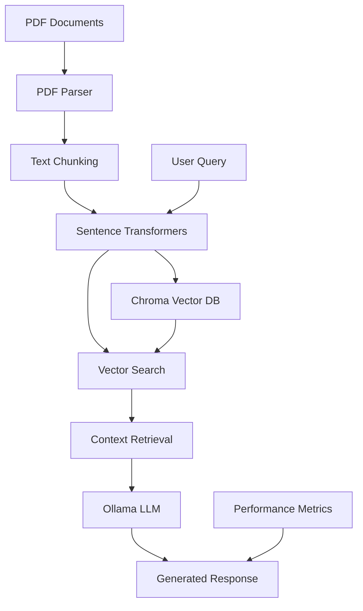

# RAG
# 🚀 High-Performance RAG Demo

A production-ready Retrieval-Augmented Generation (RAG) system built for **reducing inference latency** and **increasing output token throughput** in agentic AI applications.

   

## 🎯 Key Features

- **⚡ Ultra-Fast Performance**: Optimized for sub-5-second query responses
- **📄 Multi-Format PDF Support**: Advanced parsing with PyMuPDF + PyPDF2 fallback
- **🏠 100% Local**: No external API dependencies, complete data privacy
- **🔍 Smart Vector Search**: Chroma DB with HNSW indexing for fast similarity search
- **🤖 Local LLM Integration**: Ollama-powered inference with Llama 3.1
- **📊 Real-time Metrics**: Performance monitoring and optimization insights
- **🎨 Modern UI**: Interactive Streamlit interface with source attribution

## 🏗️ Architecture



## 🚀 Quick Start

### Prerequisites

- **Windows 10/11** with 16GB+ RAM
- **Python 3.11+** installed and in PATH
- **Git** for cloning the repository

### 1️⃣ Clone the Repository

```bash
git clone https://github.com/yourusername/rag-demo.git
cd rag-demo
```

### 2️⃣ Automated Setup (Recommended)

Run the setup script as Administrator:

```bash
setup.bat
```

This will:
- Create a Python virtual environment
- Install all required dependencies
- Set up the project structure

### 3️⃣ Install Ollama

1. **Download Ollama**: https://ollama.ai/download/windows
2. **Install and start the service**
3. **Pull the required model**:
   ```bash
   ollama pull llama3.1:8b
   ```

### 4️⃣ Launch the Demo

```bash
# Activate virtual environment (if not already active)
rag_demo\Scripts\activate

# Start the Streamlit app
streamlit run src/rag_demo.py
```

Visit `http://localhost:8501` to access the demo!

## 📁 Project Structure

```
RAG/
├── rag_demo.py
├── requirements.txt
├── setup.bat
├── prerequisite.txt
├── README.md
├── LICENSE
└── .gitignore

```

## 🔧 Configuration

### Environment Variables

Create a `.env` file in the root directory:

```env
# Ollama Configuration
OLLAMA_MODEL=llama3.1:8b
OLLAMA_HOST=http://localhost:11434

# Vector DB Configuration
VECTOR_DB_PATH=./chroma_db
COLLECTION_NAME=rag_documents

# Embedding Model
EMBEDDING_MODEL=all-MiniLM-L6-v2

# Performance Settings
CHUNK_SIZE=1000
CHUNK_OVERLAP=200
MAX_SOURCES=5
```

### Model Options

| Model | RAM Required | Speed | Quality | Use Case |
|-------|-------------|--------|---------|----------|
| `phi3:mini` | 4GB | ⚡⚡⚡ | ⭐⭐ | Quick demos |
| `llama3.1:8b` | 8GB | ⚡⚡ | ⭐⭐⭐⭐ | **Recommended** |
| `llama3.1:70b` | 32GB+ | ⚡ | ⭐⭐⭐⭐⭐ | Production |

## 📊 Performance Benchmarks

**System**: Windows 11, 16GB RAM, Intel i7

| Metric | Value | Target |
|--------|-------|--------|
| Document Processing | 1-2s/page | < 3s/page |
| Query Response Time | 2-5s | < 10s |
| Throughput | 12-20 queries/min | > 10/min |
| Memory Usage | 4-6GB | < 8GB |


### 1. **Document Upload Demo**
```bash
# Use provided sample documents or upload your own
1. Upload 3-5 PDF documents (research papers, reports)
2. Show real-time processing speed
3. Highlight chunk creation and indexing
```

### 2. **Query Performance Demo**
```bash
# Example queries to showcase
- "What are the main findings across all documents?"
- "Compare the methodologies used in different studies"
- "What recommendations are provided for implementation?"
- "Summarize the key challenges mentioned"
```

### 3. **Performance Metrics Showcase**
- Real-time latency measurements
- Source attribution with relevance scores
- Throughput monitoring
- Resource utilization stats

## 🔍 Advanced Features

### Multi-Document Cross-Referencing
The system can intelligently combine information from multiple documents to provide comprehensive answers.

### Source Attribution
Every response includes:
- Exact source document references
- Relevance scores (0.0-1.0)
- Text snippets for verification

### Performance Optimization
- **Batch Processing**: Documents processed in parallel
- **Smart Chunking**: Semantic-aware text splitting
- **Vector Caching**: Persistent embeddings storage
- **Memory Management**: Efficient resource utilization

## 🛠️ Development


## 🐛 Troubleshooting

### Common Issues

**1. "ImportError: cannot import name 'cached_download'"**
```bash
# Run the fix script
# check if there are version mismatch and install the required package, refer prerequisites.txt if you missed any package
```

**2. "Ollama connection failed"**
```bash
# Check if Ollama is running
ollama serve

# Test model availability
ollama run llama3.1:8b "Hello"
```

**3. "Out of memory errors"**
- Switch to a smaller model: `phi3:mini`
- Reduce chunk size in configuration
- Close other applications

See [TROUBLESHOOTING.md](docs/TROUBLESHOOTING.md) for detailed solutions.

## 🗺️ Roadmap

- [ ] **GPU Acceleration**: CUDA support for faster inference
- [ ] **Cloud Deployment**: Docker containerization
- [ ] **Enterprise Features**: Multi-user support, authentication
- [ ] **Advanced RAG**: Re-ranking, query expansion
- [ ] **API Server**: REST API for integration
- [ ] **Monitoring**: Prometheus metrics, logging

## 🤝 Contributing

1. Fork the repository
2. Create a feature branch (`git checkout -b feature/amazing-feature`)
3. Commit your changes (`git commit -m 'Add amazing feature'`)
4. Push to the branch (`git push origin feature/amazing-feature`)
5. Open a Pull Request

## 📄 License

This project is licensed under the MIT License - see the [LICENSE](LICENSE) file for details.

## 🙏 Acknowledgments

- **Ollama** for local LLM inference
- **Chroma** for vector database capabilities
- **Sentence Transformers** for embedding generation
- **Streamlit** for the web interface
- **LangChain** for RAG pipeline components

## 📬 Contact

Made with ❤️ by [Pannagendra KL](https://github.com/Pannagendra)

---

**Built with ❤️ for the AI community**

⭐ **Star this repo if it helped you build better RAG systems!**
